# CycleGAN project
MIPT DLS part 1 final project 
Модель была обучена на 3 датасетах. Facades и horse2zebras были использованы в оригинальной [статье](https://arxiv.org/abs/1703.10593). Датасет состоящий из арбузов и тыкв был собран специально для этой задачи в основном из google картинок. Для повышения качества результатов, датасет состоит из изображений целых арбузов и тыкв.
## Некоторые параметры моделей:
- Изображения имеют размер 256x256
- Как рекомендовано [здесь](https://github.com/junyanz/pytorch-CycleGAN-and-pix2pix/issues/190#issuecomment-358546675) и [здесь](https://distill.pub/2016/deconv-checkerboard/) вместо ConvTransposed2d использовался следующий вариант
~~~~python
         nn.Upsample(scale_factor = 2, mode='nearest'),
         nn.ReflectionPad2d,
         nn.Conv2d,
~~~~
- Как и в оригинальной статье batch_size = 1
- Число эпох = 200
- lr = 0.0002 и убывает линейно до нуля после 100 эпох
- При обучении использовался буффер из 50 изображений 
- identity loss не использовался
## Обучение 
На facades и horse2zebra модели были обучены с параметрами выше. На watermelon2pumpkin модели были обучены до 100 эпох и до 200. Качество при обучении до 100 эпох кажется немного выше и итоговые результаты получены при использовании такой модели. В папке [weights](./weights) есть веса для всех 4-х вариантов. Были построены [графики](./losses) суммарных лоссов генераторов и дискриминаторов(в основном для контроля правильности обучения). 
# Результаты
Результаты сопоставимы с [полученными](https://taesung.me/cyclegan/2017/03/25/horse-to-zebra-supplemental-best.html) в оригинальной статье. Больше изображений в [results](./results)
## Facades
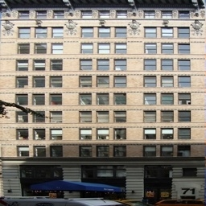
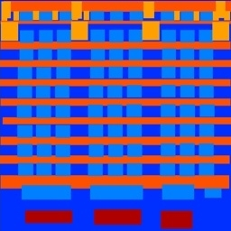
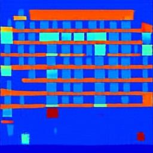
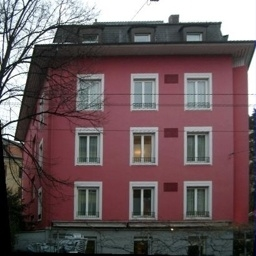
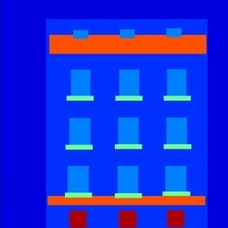
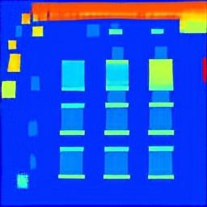
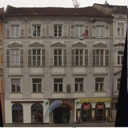
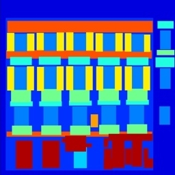
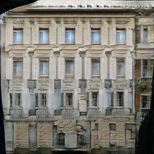
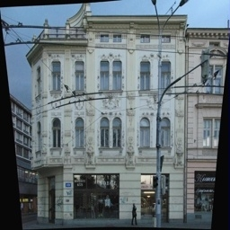
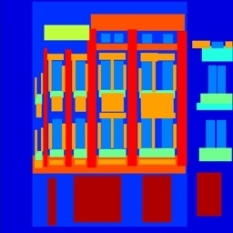
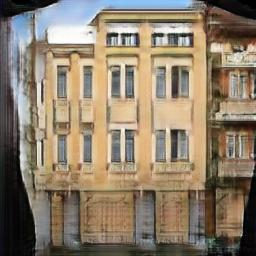

## Horse2Zebra
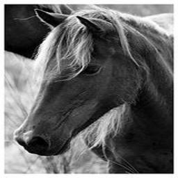
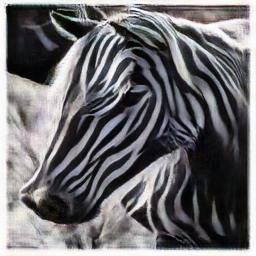 
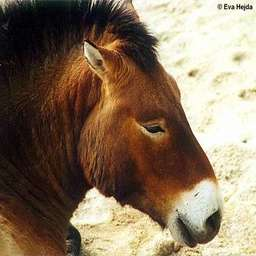
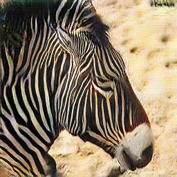 
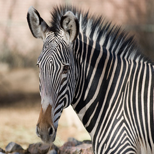
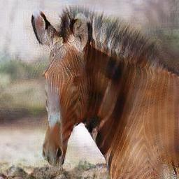 
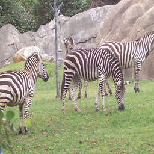
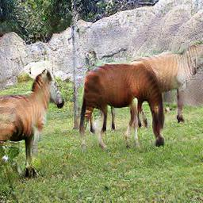
## Watermelon2Pumpkins
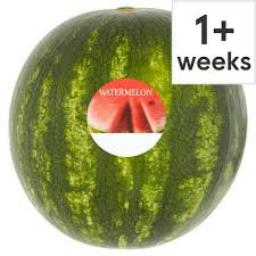
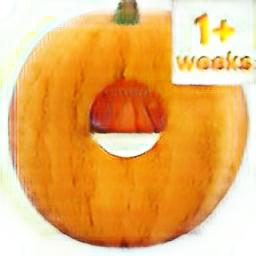 
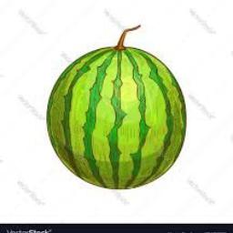
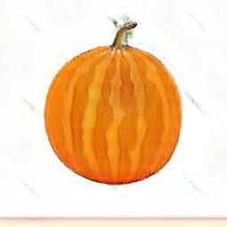 

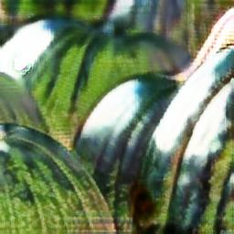 

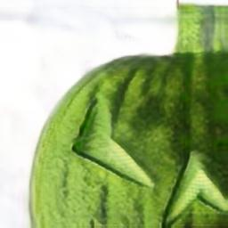 
# Модель
## Структура репозитория
- bin - загрузка датасетов
- losses - графики лоссов при обучении
- results - полученные изображения
- src/data - dataloaders
- src/model - генератор и дискриминатор
- src/utils/other - буффер и вспомогательные функции
- src/utils/config - параметры моделей
- weights - веса с описанием
## Параметры
Для загрузки датасетов(кроме watermelon2pumpkin) используется 
~~~~
./download_data.sh dataset_name
~~~~
watermelon2pumpkin необходимо загружать с google drive 
Для обучения модели
~~~~
train.py -n number_of_epochs -sd directory_for_model_weights 
      -dA directory_with_train_images_A -dB directory_with_train_images_B
~~~~
Для генерации изображений 
~~~~
generate.py -n number_of_epochs 
      -sd directory_for_model_weights 
      -dA directory_with_images_A 
      -dB directory_with_images_B
      -drA directory_for_transformed_A
      -drB directory_for_transformed_B
      -wG dir_for_G_weights
      -wF dir_for_F_weights
~~~~
Для более удобной настройки параметров модели для генерации и обучения можно использовать config.py
# Ссылки
original paper
~~~~
@inproceedings{CycleGAN2017,
  title={Unpaired Image-to-Image Translation using Cycle-Consistent Adversarial Networks},
  author={Zhu, Jun-Yan and Park, Taesung and Isola, Phillip and Efros, Alexei A},
  booktitle={Computer Vision (ICCV), 2017 IEEE International Conference on},
  year={2017}
}
~~~~
Facades dataset
~~~~
@INPROCEEDINGS{Tylecek13,
  author = {Radim Tyle{\v c}ek, Radim {\v S}{\' a}ra},
  title = {Spatial Pattern Templates for Recognition of Objects with Regular Structure},
  booktitle = {Proc. GCPR},
  year = {2013},
  address = {Saarbrucken, Germany},
}
~~~~
